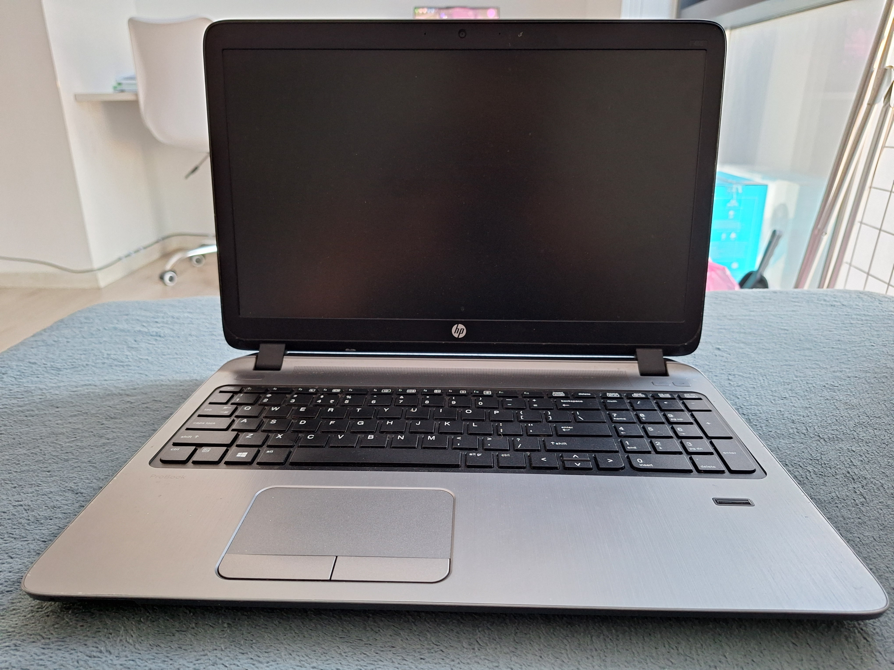
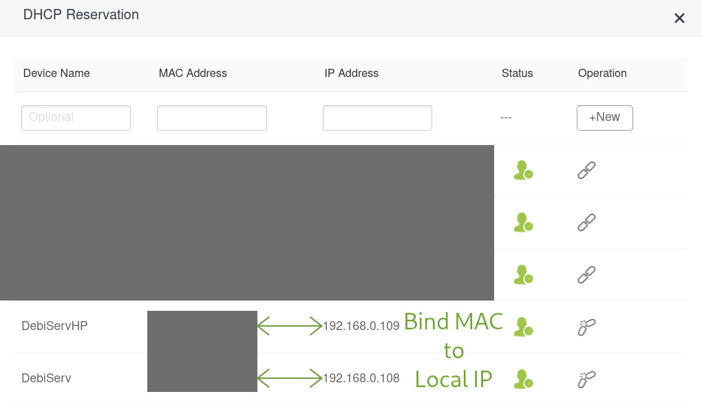

# Table of Contents

- [DIY Home Server](#diy-home-server)
- [Hardware](#hardware)
  - [Lenovo ThinkPad T430 (Main Server)](#lenovo-thinkpad-t430-main-server)
  - [HP ProBook 455 G2 (Testing Machine)](#hp-probook-455-g2-testing-machine)
- [Operating System](#operating-system)
  - [Initial Plan](#initial-plan)
  - [Final Approach](#final-approach)
- [Network](#network)
  - [Solution: DHCP Reservation (Static Local IP)](#solution-dhcp-reservation-static-local-ip)
  - [Network Schema](#network-schema)
- [Laptop Power Configuration](#laptop-power-configuration)
  - [Lid Configuration](#lid-configuration)
  - [Disable Sleep / Suspend](#disable-sleep--suspend)
  - [Battery Configuration](#battery-configuration)
  - [Wake-on-LAN (WoL)](#wake-on-lan-wol)

# DIY Home Server

This repository documents my journey of building and configuring a DIY home server.

I decided to create this server because I had a couple of old laptops that were just sitting unused. Instead of letting them collect dust, I repurposed them into a small home server environment.

This repo contains the commands, configurations, and notes from the setup process.  
Later I plan to add explanations, screenshots, and short videos.

---

# Hardware

Currently using two machines as part of this DIY server setup.

## Lenovo ThinkPad T430 (Main Server)


- CPU: Intel i5-3320M  
- RAM: 8 GB DDR3  
- Storage: 500 GB SATA III SSD  
- 1 Gbps NIC with support for Wake on Lan

This machine acts as the **main server**, as it has more reliable performance and significantly more storage available.

## HP ProBook 455 G2 (Testing Machine)




- CPU: AMD A8-7100  
- RAM: 8 GB DDR3  
- Storage: 120 GB SATA III SSD  
- 1 Gbps NIC with support for Wake on Lan

The **HP ProBook struggles with performance and has limited storage**, so it is mainly used as a **testing environment**.  
I use it to experiment with configurations, services, and setups before applying them to the ThinkPad server, which helps avoid breaking the main system and having to reconfigure it.

> **Note:** From this point onward, all setup and configuration steps described in this documentation refer **only to the ThinkPad T430**, which serves as the main server.

---

# Operating System


The server currently runs:

- **Debian 13 Stable (Trixie)**

### Initial Plan

My initial plan was to run **Proxmox** and structure the system with:

- 1 **Debian VM** running Docker conatiners
- several **LXC containers** for different services

### Final Approach

The hardware was **not suitable for a full virtualization stack**. Running Proxmox, a VM, and multiple containers would have added too much overhead on machine with limited CPU and RAM.

Instead, I installed **Debian 13 Stable directly on the ThinkPad T430 (bare metal)**.

The system was installed using a **minimal setup with no desktop environment**, since:

- the server is managed entirely through **SSH**
- a graphical interface is **not necessary**
- avoiding a GUI saves **RAM and CPU resources**

---

# Network

In most home networks, devices receive their **local IP address dynamically** through DHCP.  
This means the router automatically assigns an available IP address to each device when it connects to the network.

In order to access the server or any of its services, you need to know its local IP address.  
This can be retrieved either from the server itself or from the router’s admin panel, which can be annoying.

### Solution: DHCP Reservation (Static Local IP)

I chose to create a **DHCP reservation from the router**, which always assigns the **same IP address to each server based on its MAC address**.

> Note: It is also possible to set a static IP manually on the server itself, but using the router simplifies management.

Router configuration example:



In my setup, the router is configured to always assign the same IP address for each server.

### Network Schema

For now, I only have a **single Wireless Router** handling all roles.
> **Note:** In the future, I plan to separate these functions into specialized devices:
>
> - **Gigabit switch** for wired connections  
> - **Custom router** running OPNsense or pfSense 
> - **Access Point** for WiFi
Router and server setup:

<!--  -->

Below is an **ASCII diagram** illustrating the layout of the whole network:

```
               ISP
                │
               WAN
        ┌─────────────────────────────────┐
        │         Wireless Router         │
        │---------------------------------│
        │ WAN                             │
        │ LAN0                            │
        │ LAN1                            │
        │ LAN2                            │
        │ WiFi                            │
        └─────────────────────────────────┘
          LAN0   LAN1  LAN2    WiFi
           │      │      │      │
           │      │      │      ├─device0
           │      │      │      ├─device1
           │      │      │      ├─device2    
           │      │      │      ├─device3    
           │      │      │      └─deviceN    
           │      │      │          
           │      │      │
           │      │      └── My Laptop
           │      │
           │      └── HP Server
           │
           └── ThinkPad Server
```

---

# Laptop Power Configuration

Since the server runs on a **laptop (ThinkPad T430)** instead of traditional server hardware, a few adjustments are necessary.

Laptops are designed to prioritize **power saving and efficiency**, which can interfere with a system intended to run **continuously as a server**.

The following configurations ensure the laptop stays powered on even when the lid is closed, prevents sleep/suspend states, allows remote power-on, and helps preserve battery health.

---

## Lid Configuration

Prevent the laptop from sleeping when the lid is closed.

Edit:

```
/etc/systemd/logind.conf
```

Uncomment and modify the following parameters:


Restart the service:

```bash
sudo systemctl restart systemd-logind
```

---

## Disable Sleep / Suspend

Disable all sleep targets to ensure the server remains active.

```bash
sudo systemctl mask sleep.target suspend.target hibernate.target hybrid-sleep.target
```

---

## Battery Configuration

Limit battery charging to **80%** to reduce long-term battery wear.

```bash
echo 80 | sudo tee /sys/class/power_supply/BAT0/charge_control_end_threshold
```

> **Note:** Battery device names (for example `BAT0`) and configuration paths may differ depending on the laptop model and hardware configuration.

> **Note:** Some laptops may not support limiting battery charge at the hardware/firmware level, meaning this feature might not be available on all systems.

> **Note:** The link below includes additional methods and troubleshooting steps if this method does not work on a specific system.

Reference:

https://ubuntuhandbook.org/index.php/2024/02/limit-battery-charge-ubuntu/

---

## Wake-on-LAN (WoL)

Wake-on-LAN allows the server to be **powered on remotely** by sending a *magic packet* to its network interface.

> **Important:** Wake-on-LAN must first be **enabled in the system BIOS/UEFI**.

Before configuring WoL, identify the **network interface name** and **MAC address**:

```bash
ip a
```

This command lists all network interfaces. From here you can find:

- the **network interface name** (for example `enp1s0`)
- the **MAC address** used for Wake-on-LAN

The MAC address can also usually be found in the **router's admin panel** under the list of connected devices.

Install the required tool:

```bash
sudo apt install ethtool
```

Enable WoL on the network interface:

```bash
sudo ethtool -s enp1s0 wol g
```

To make this persistent after reboot, create a systemd service:

```bash
sudo nano /etc/systemd/system/wol-enable.service
```

Service configuration:

```
[Unit]
Description=Configure Wake-up on LAN
After=network-online.target

[Service]
Type=oneshot
ExecStart=/sbin/ethtool -s enp1s0 wol g

[Install]
WantedBy=basic.target
```

Enable the service:

```bash
sudo systemctl enable wol-enable.service
```

The server can then be powered on remotely using:

```bash
wakeonlan <MAC_ADDRESS>
```

<!-- Example WoL demonstration: -->

<!--  -->

> **Note:** There are multiple ways to configure Wake-on-LAN depending on the system, network interface, and distribution. The reference below includes alternative approaches and troubleshooting information.

Reference:

https://www.thelinuxvault.net/blog/how-to-wake-on-lan-supported-host-over-the-network-using-linux/

---