<!--# Table of Contents-->
<details open>
<summary><strong>Table of Contents</strong></summary>

<br>

- [DIY Home Server](#diy-home-server)

- [Hardware](#hardware)
  - [Lenovo ThinkPad T430 (Main Server)](#lenovo-thinkpad-t430-main-server)
  - [HP ProBook 455 G2 (Backup Server)](#hp-probook-455-g2-backup-server)

- [Operating System](#operating-system)
  - [Initial Plan](#initial-plan)
  - [Final Approach](#final-approach)

- [Network](#network)
  - [Solution: DHCP Reservation (Static Local IP)](#solution-dhcp-reservation-static-local-ip)
  - [Network Schema](#network-schema)

- [Laptop Power Configuration](#laptop-power-configuration)
  - [Lid Configuration](#lid-configuration)
  - [Disable Sleep / Suspend](#disable-sleep--suspend)
  - [Battery Configuration](#battery-configuration)
  - [Wake-on-LAN (WoL)](#wake-on-lan-wol)

- [Essential Utilities & Access](#essential-utilities--access)
  - [SSH - Remote Server Access](#ssh---remote-server-access)
  - [System Monitoring Tools](#system-monitoring-tools)

- [Main Server - Services Setup](#main-server---services-setup)
    - [Storage Layout](#storage-layout)
    - [Storage Permissions](#storage-permissions)
    - [Samba - Network File Sharing (NAS)](#samba---network-file-sharing-nas)
    - [Navidrome - Self-Hosted Music Streaming](#navidrome---self-hosted-music-streaming)
    - [Obsidian + Syncthing - Notes & Synchronization](#obsidian---browser-hosted-instance)
    - [Lancache - Local Game Download Cache](#lancache---local-game-download-cache)
    - [Minecraft - LAN Server](#minecraft---lan-server)

- [Remote Access - Wireguard VPN](#remote-access---wireguard-vpn)
  - [Why I Chose This Option](#why-i-chose-this-option)
  - [Key Generation](#key-generation)
  - [VPS Relay Server](#vps-relay-server)
  - [Secure SSH Access to VPS](#secure-ssh-access-to-vps)
  - [Enable IP Forwarding (VPS)](#enable-ip-forwarding-vps)
  - [Firewall Setup (UFW)](#firewall-setup-ufw)
  - [VPS WireGuard Configuration](#vps-wireguard-configuration)
  - [Home Server Peer Configuration](#home-server-peer-configuration)
  - [Client Configuration-laptop-phone](#client-configuration-laptop--phone)
  - [Split Tunnel Behavior](#split-tunnel-behavior)
  - [Testing Connectivity](#testing-connectivity)


- [Backup](#backup)
  - [BorgBackup](#borgbackup)
  - [Install BorgBackup](#install-borgbackup)
  - [Backup Server Configuration](#backup-server-configuration)
  - [Main Server Configuration](#main-server-configuration)
  - [Initialize Borg Repository](#initialize-borg-repository)
  - [Automated Backup Script](#automated-backup-script)
  - [Running the Backup](#running-the-backup)
  - [Automated Backups with Cron](#automated-backups-with-cron)
  - [Backup Strategy](#backup-strategy)
  - [Security Notes](#security-notes)
  - [Screenshots](#screenshots) 

<br>

</details>


# DIY Home Server

This repository documents my journey of building and configuring a DIY home server.

I decided to create this server because I had a couple of old laptops that were just sitting unused. Instead of letting them collect dust, I repurposed them into a small home server environment.

This repo contains the commands, configurations, and notes from the setup process.  
Later I plan to add explanations, screenshots, and short videos.


---

# Hardware

Currently using two machines as part of this DIY server setup. The system is built around a **primary server** and a **secondary backup server**.

## Lenovo ThinkPad T430 (Main Server)


- CPU: Intel i5-3320M  
- RAM: 8 GB DDR3  
- Storage: 500 GB SATA III SSD  
- 1 Gbps NIC with support for Wake on Lan

This machine acts as the **main server**, as it has better performance and significantly more storage available. It hosts the primary services of the system and runs most applications through Docker containers.

## HP ProBook 455 G2 (Backup Server)


- CPU: AMD A8-7100  
- RAM: 8 GB DDR3  
- Storage: 120 GB SATA III SSD  
- 1 Gbps NIC with support for Wake on Lan

This machine acts as a **backup server**. The **HP ProBook struggles with performance and has limited storage**, so it is mainly used for storing **backups of important data**. 
---

# Operating System


The server currently runs:

- **Debian 13 Stable (Trixie)**

### Initial Plan

My initial plan was to run **Proxmox** and structure the system with:

- 1 **Debian VM** running Docker conatiners
- several **LXC containers** for different services

### Final Approach

The hardware was **not suitable for a full virtualization stack**. Running Proxmox, a VM, and multiple containers would have added too much overhead on machine with limited CPU and RAM.

Instead, I installed **Debian 13 Stable directly on the ThinkPad T430 (bare metal)**.

The system was installed using a **minimal setup with no desktop environment**, since:

- the server is managed entirely through **SSH**
- a graphical interface is **not necessary**
- avoiding a GUI saves **RAM and CPU resources**

---

# Network

In most home networks, devices receive their **local IP address dynamically** through DHCP.  
This means the router automatically assigns an available IP address to each device when it connects to the network.

In order to access the server or any of its services, you need to know its local IP address.  
This can be retrieved either from the server itself or from the router’s admin panel, which can be annoying.

### Solution: DHCP Reservation (Static Local IP)

I chose to create a **DHCP reservation from the router**, which always assigns the **same IP address to each server based on its MAC address**.

> Note: It is also possible to set a static IP manually on the server itself, but using the router simplifies management.

Router configuration example:


In my setup, the router is configured to always assign the same IP address for each server.

### Network Schema

For now, I only have a **single Wireless Router** handling all roles.
> **Note:** In the future, I plan to separate these functions into specialized devices:
>
> - **Gigabit switch** for wired connections  
> - **Custom router** running OPNsense or pfSense 
> - **Access Point** for WiFi
Router and server setup:

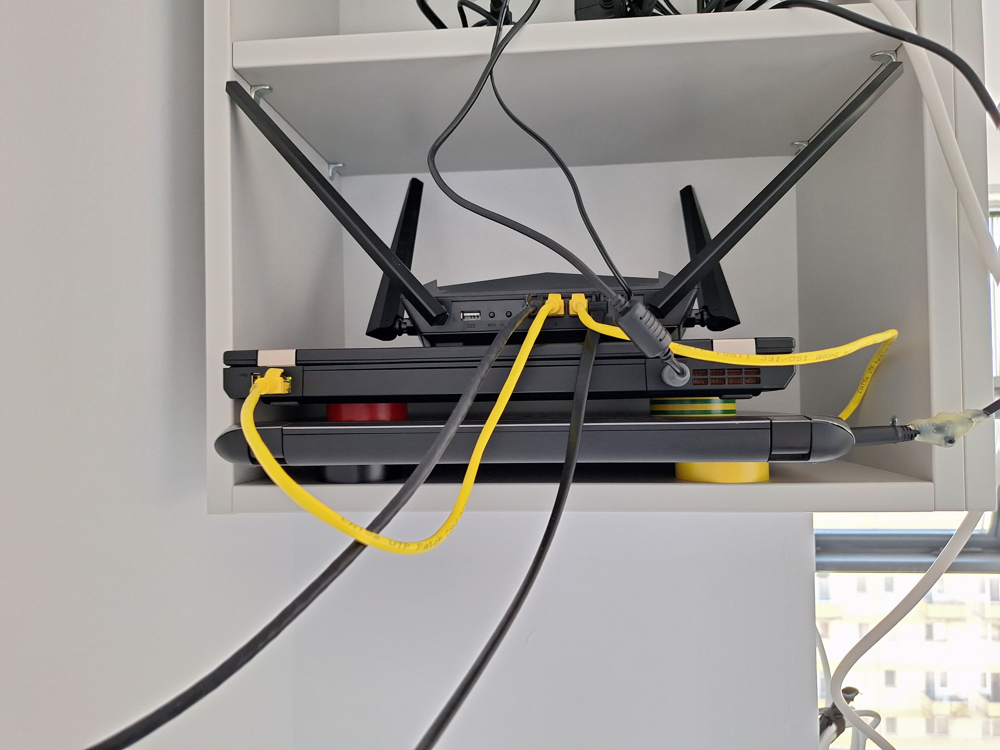

Below is an **ASCII diagram** illustrating the layout of the whole network:

```
               ISP
                │
               WAN
        ┌─────────────────────────────────┐
        │         Wireless Router         │
        │---------------------------------│
        │ WAN                             │
        │ LAN0                            │
        │ LAN1                            │
        │ LAN2                            │
        │ WiFi                            │
        └─────────────────────────────────┘
          LAN0   LAN1  LAN2    WiFi
           │      │      │      │
           │      │      │      ├─device0
           │      │      │      ├─device1
           │      │      │      ├─device2    
           │      │      │      ├─device3    
           │      │      │      └─deviceN    
           │      │      │          
           │      │      │
           │      │      └── My Laptop
           │      │
           │      └── HP Server
           │
           └── ThinkPad Server
```
---

<br>
<br>

# Laptop Power Configuration

Since the server runs on a **laptop (ThinkPad T430)** instead of traditional server hardware, a few adjustments are necessary.

Laptops are designed to prioritize **power saving and efficiency**, which can interfere with a system intended to run **continuously as a server**.

The following configurations ensure the laptop stays powered on even when the lid is closed, prevents sleep/suspend states, allows remote power-on, and helps preserve battery health.

---

## Lid Configuration

Prevent the laptop from sleeping when the lid is closed.

Edit:

```
/etc/systemd/logind.conf
```

Uncomment and modify the following parameters:


Restart the service:

```bash
sudo systemctl restart systemd-logind
```

---

## Disable Sleep / Suspend

Disable all sleep targets to ensure the server remains active.

```bash
sudo systemctl mask sleep.target suspend.target hibernate.target hybrid-sleep.target
```

---

## Battery Configuration

Limit battery charging to **80%** to reduce long-term battery wear.

```bash
echo 80 | sudo tee /sys/class/power_supply/BAT0/charge_control_end_threshold
```

> **Note:** Battery device names (for example `BAT0`) and configuration paths may differ depending on the laptop model and hardware configuration.

> **Note:** Some laptops may not support limiting battery charge at the hardware/firmware level, meaning this feature might not be available on all systems.

> **Note:** The link below includes additional methods and troubleshooting steps if this method does not work on a specific system.

Reference:

https://ubuntuhandbook.org/index.php/2024/02/limit-battery-charge-ubuntu/

---

## Wake-on-LAN (WoL)

Wake-on-LAN allows the server to be **powered on remotely** by sending a *magic packet* to its network interface.

> **Important:** Wake-on-LAN must first be **enabled in the system BIOS/UEFI**.

Before configuring WoL, identify the **network interface name** and **MAC address**:

```bash
ip a
```

This command lists all network interfaces. From here you can find:

- the **network interface name** (for example `enp1s0`)
- the **MAC address** used for Wake-on-LAN

The MAC address can also usually be found in the **router's admin panel** under the list of connected devices.

Install the required tool:

```bash
sudo apt install ethtool
```

Enable WoL on the network interface:

```bash
sudo ethtool -s enp1s0 wol g
```

To make this persistent after reboot, create a systemd service:

```bash
sudo nano /etc/systemd/system/wol-enable.service
```

Service configuration:

```
[Unit]
Description=Configure Wake-up on LAN
After=network-online.target

[Service]
Type=oneshot
ExecStart=/sbin/ethtool -s enp1s0 wol g

[Install]
WantedBy=basic.target
```

Enable the service:

```bash
sudo systemctl enable wol-enable.service
```

The server can then be powered on remotely using:

```bash
wakeonlan <MAC_ADDRESS>
```

<!-- Example WoL demonstration: -->

<!--  -->

> **Note:** There are multiple ways to configure Wake-on-LAN depending on the system, network interface, and distribution. The reference below includes alternative approaches and troubleshooting information.

Reference:

https://www.thelinuxvault.net/blog/how-to-wake-on-lan-supported-host-over-the-network-using-linux/

<!-- <br> -->
<!-- <br> -->

---

# Essential Utilities & Access

The following configurations are applied to **both servers**.

They provide:

- **Remote management** (SSH)
- **Basic system monitoring tools**

---

## SSH - Remote Server Access

SSH allows the server to be managed remotely from another machine through the terminal.

### Installation

Install the SSH server:

```bash
sudo apt install openssh-server
```

Enable and start the service:

```bash
sudo systemctl enable ssh
sudo systemctl start ssh
```

### Connecting to the Server

From another machine on the network, connect using the following command.  
In my case:

```bash
ssh dev@192.168.0.109
```

Where:

- `dev` is the username on the server  
- `192.168.0.109` is the server's local IP address

For **Linux and Windows**, I usually connect directly from the **terminal** using the command shown above.

For **Android**, I use the **Termius** SSH client to connect to the servers.

| | |
|---|---|
| 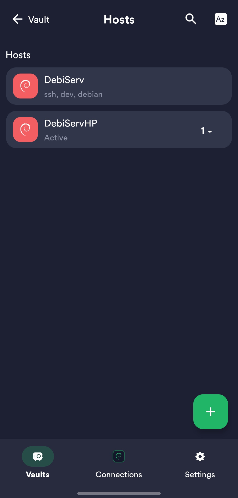 | 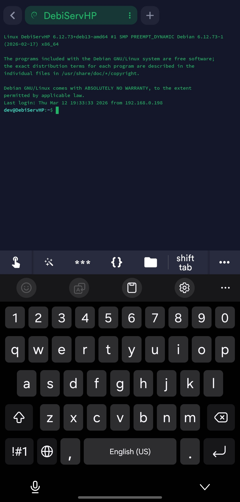 |

---

## System Monitoring Tools

Some lightweight tools are installed to quickly inspect system information and resource usage.

### fastfetch

Displays system information.

```bash
sudo apt install fastfetch
```

Run:

```bash
fastfetch
```

### btop

Interactive resource monitor.

```bash
sudo apt install btop
```

Run:

```bash
btop
```

### htop

Alternative terminal system monitor.

```bash
sudo apt install htop
```

Run:

```bash
htop
```


---


# Main Server - Services Setup

The **ThinkPad T430** acts as the **main server** in this setup.

It is responsible for:

- running **Docker services**
- providing **network storage (NAS)** via Samba
- storing application data and media

---

## Storage Layout

Before setting everything up, I defined a directory structure to clearly separate:

- **Docker configurations**
- **shared data (NAS)**
- **service-specific data**

Planned layout:

```
/
├── srv
│   └── docker
│       └── navidrome
│           └── docker-compose.yml
│
└── data
    ├── shares
    │   └── media
    │       └── music
    │
    └── services
        └── navidrome
            ├── navidrome.db
            └── cache
```

This structure keeps:

- configs in `/srv/docker`
- user-accessible files in `/data/shares`
- service data isolated in `/data/services`

---

## Storage Permissions

To keep permissions clean and manageable, I created a dedicated **group for storage access** and configured a shared directory.

### Create storage group and configure permissions

```bash
sudo groupadd storage
sudo usermod -aG storage dev
sudo chown -R root:storage /data
sudo chmod -R 2775 /data
```

Explanation:

- `storage` → shared group for file access  
- `dev` → added to the group  
- `/data` → main shared directory  
- `2775` → ensures new files inherit the group

---

## Samba - Network File Sharing (NAS)

Samba is used to expose the `/data` directory to other devices on the network.

I chose **Samba (SMB)** instead of **NFS** because I access the server from multiple operating systems:

- **Linux**
- **Windows**
- **Android**

SMB is natively supported on all of these platforms, making it a more flexible choice.  
NFS is more common in Linux-only environments, but requires additional setup or third-party tools on Windows and Android.

### Installation

```bash
sudo apt update
sudo apt install samba
```

Enable and start the service:

```bash
sudo systemctl enable smbd
sudo systemctl start smbd
```

Check status:

```bash
sudo systemctl status smbd
```

---

### User setup

Enable Samba access for the user:

```bash
sudo smbpasswd -e dev
```

---

### Configuration

Edit the Samba configuration file:

```bash
sudo nano /etc/samba/smb.conf
```

Add the following:

```
[global]
server string = DebiServ
workgroup = WORKGROUP
security = user
map to guest = Bad User

[data]
path = /data
force user = dev
force group = storage
create mask = 0664
force create mode = 0664
directory mask = 0775
force directory mode = 0775
browseable = yes
writable = yes
guest ok = no
read only = no
```


---

### Configuration Explanation

- `[global]` → general server settings  
- `server string` → server name shown on the network  
- `workgroup` → Windows workgroup (default: WORKGROUP)  
- `security = user` → requires authentication  
- `map to guest = Bad User` → unknown users are treated as guests  

---

- `[data]` → shared folder definition  
- `path = /data` → directory being shared  
- `force user / group` → ensures consistent ownership of files  
- `create mask = 0664` → file permissions (rw-rw-r--)  
- `directory mask = 0775` → directory permissions (rwxrwxr-x)  
- `browseable = yes` → visible on the network  
- `writable = yes` → allows writing  
- `guest ok = no` → disables anonymous access  
- `read only = no` → allows modifications  

---

> **Note:** I recommend creating the Samba configuration from scratch instead of modifying the default file.  
> This helps keep the configuration clean and avoids unnecessary or confusing defaults.
>
> You can keep the original file as a reference by renaming it:
>
> ```bash
> sudo mv /etc/samba/smb.conf /etc/samba/smb.conf.old
> ```
>
> Then create a new configuration file:
>
> ```bash
> sudo nano /etc/samba/smb.conf
> ```

---

Apply changes:

```bash
sudo systemctl restart smbd
```

---

 #### Accessing the NAS from different devices (Local Network)

**Linux**
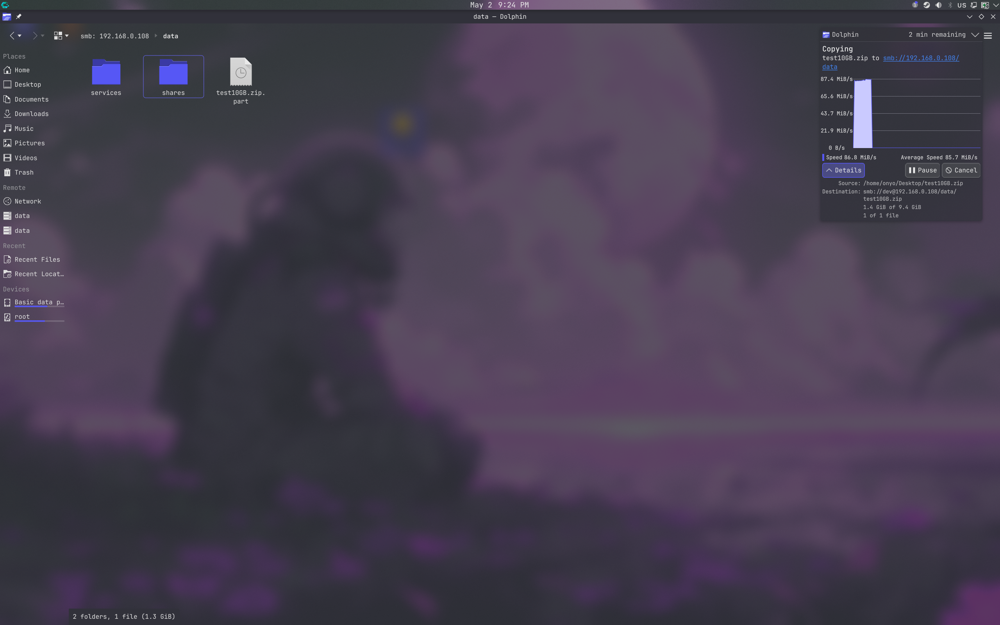

**Windows**
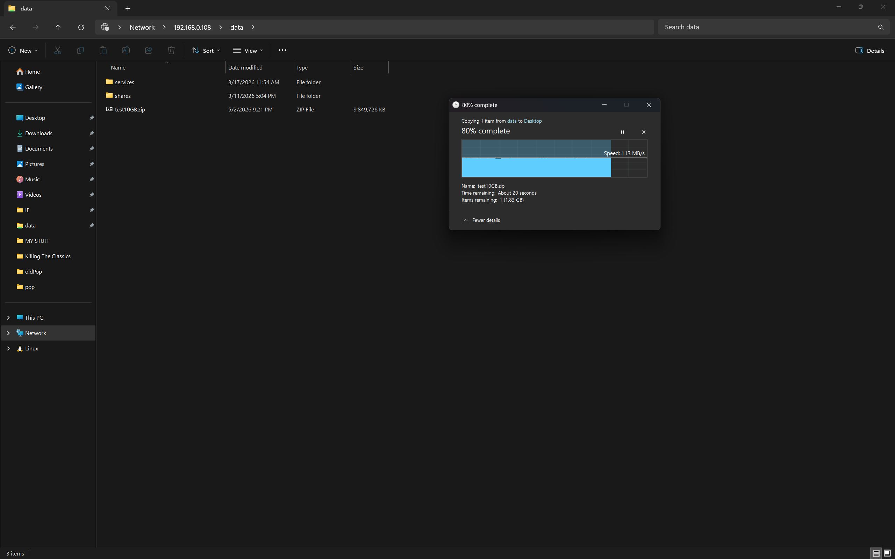

**Android**
<p align="center">
  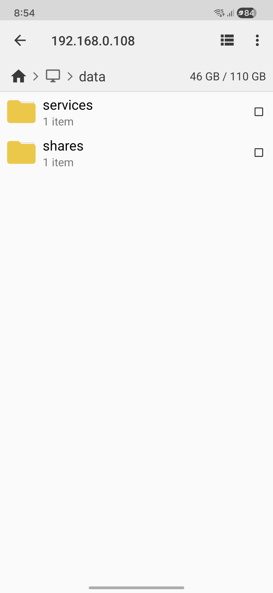
</p>

### Accessing the NAS Through VPN (Remote Access)

When connected to the WireGuard tunnel, the Samba share can also be accessed securely using the server's VPN IP address.

#### Linux (VPN)


---

#### Android (VPN)

<p align="center">
  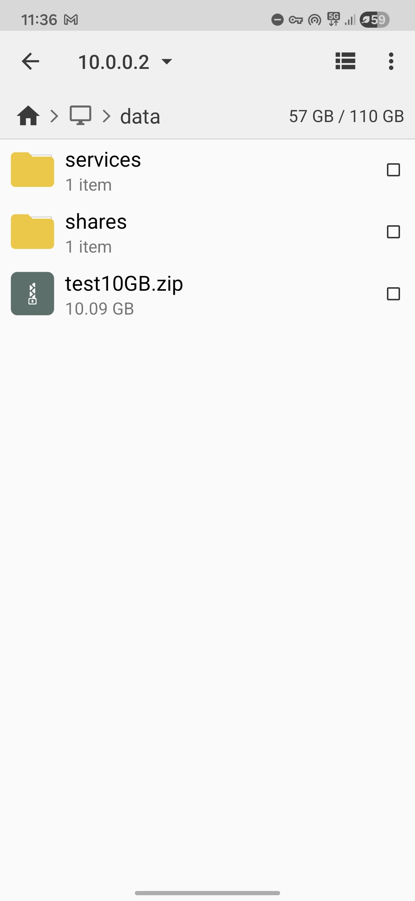
</p>

--- 

## Navidrome - Self-Hosted Music Streaming

**Navidrome** is a lightweight self-hosted music server and web-based player.

It allows streaming your personal music library from:

- web browser
- Android apps
- Subsonic-compatible clients
- other devices on the network

Official documentation:

https://www.navidrome.org/docs/installation/docker/

---

### My Music Library

My personal music collection is stored locally and served through Navidrome.

Library details:

- around **1100 songs**
- approximately **35 GB**
- all files in **FLAC** format
- organized into folders representing playlists

I originally kept most of my music on **Spotify**.  
Later, I transferred the library to **Deezer**, then used **Deemix** to download and preserve the collection locally in FLAC quality.

This gives me:

- full ownership of my library
- offline access
- no subscription dependency
- higher audio quality
- compatibility with self-hosted streaming

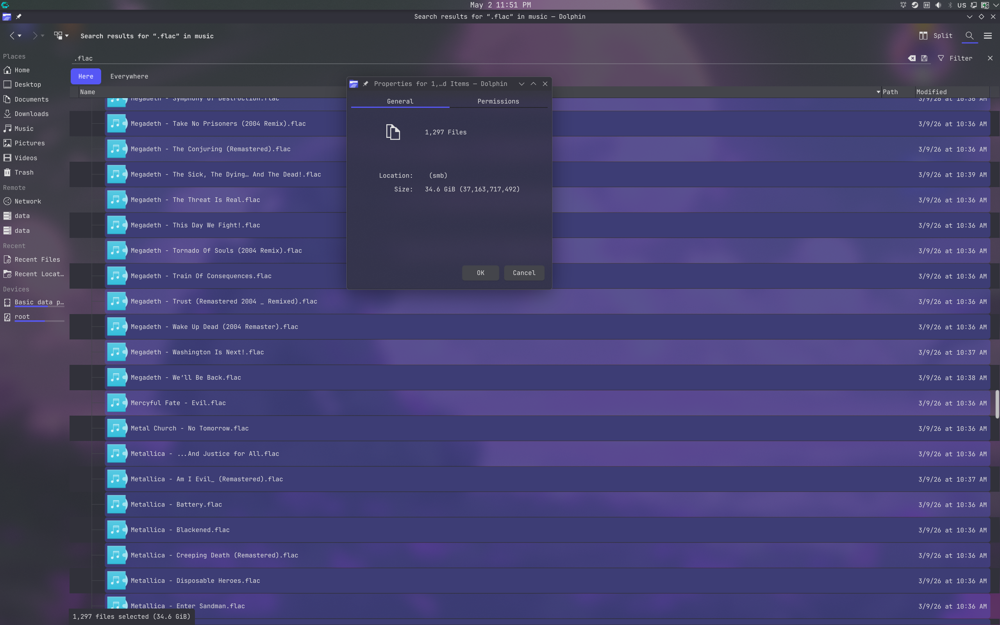

---

### Directory Location

Docker project files are stored in:

```bash
/srv/docker/navidrome
```

---

### Docker Compose Configuration

Create:

```bash
sudo nano /srv/docker/navidrome/docker-compose.yml
```

Add:

```yaml
services:
  navidrome:
    image: deluan/navidrome:latest
    user: 1000:1000
    ports:
      - "4533:4533"
    restart: unless-stopped
    environment:
      ND_LOGLEVEL: info
    volumes:
      - "/data/services/navidrome/:/data"
      - "/data/shares/media/music/:/music:ro"
```

---

### Volume Explanation

```bash
/data/services/navidrome/
```

Used for:

- application data
- database
- cache
- metadata

This folder is also accessible through Samba for easier management.

---

```bash
/data/shares/media/music/
```

Used as the main music library location.

This is where I store my music files.

It is mounted as:

```bash
/music:ro
```

Meaning:

- read-only for the container
- protects music files from accidental modification

---

### Starting the Container

From the project directory:

```bash
cd /srv/docker/navidrome
docker compose up -d
```

---

### Accessing Navidrome

Open in browser:

```text
http://SERVER_IP:4533
```

Example:

```text
http://192.168.0.108:4533
```

---

### Clients

I currently use the following clients to access Navidrome.

#### PC / Linux / Windows

- Web browser
- SubTUI (Subsonic-compatible CLI client)


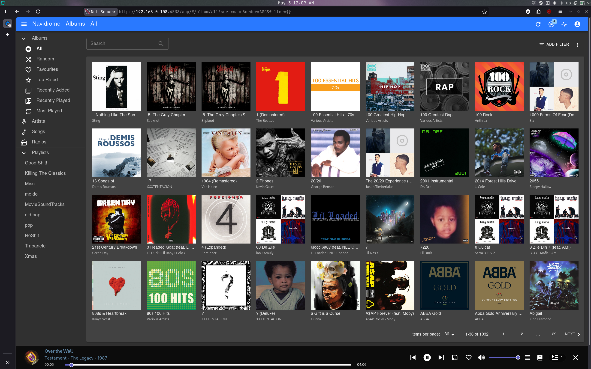
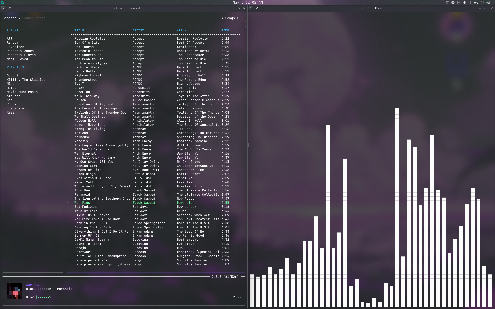


---

#### Android

- **Symfonium** *(paid one-time purchase, around 25 RON)*

> Note: There are multiple options for clients compatible with Navidrome: https://www.navidrome.org/apps/

<p align="center">
  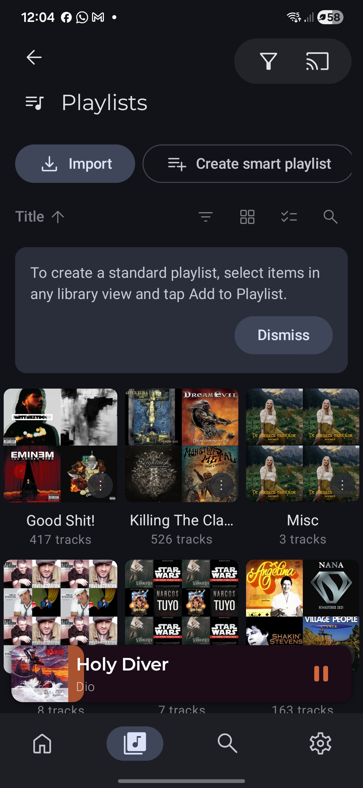
</p>

---


### VPN Access

Navidrome can also be accessed remotely through the **WireGuard VPN tunnel**.

This allows me to stream my music library securely from outside my home network without exposing the service publicly to the internet.

---

#### PC Access over VPN

Accessing Navidrome from browser through the VPN tunnel:

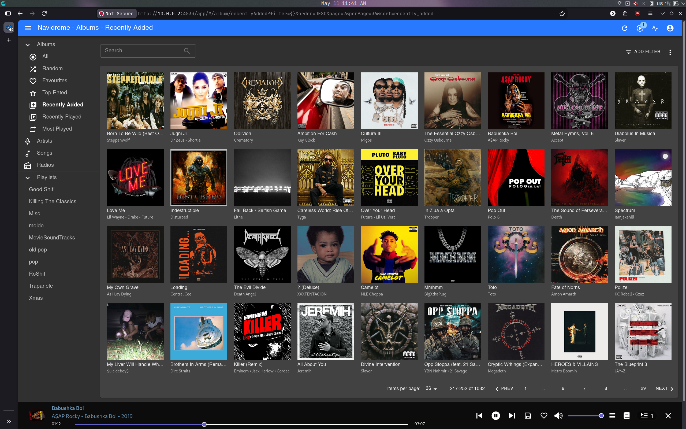

---

#### Android Access over VPN

Accessing Navidrome remotely through **Symfonium** on Android:

<p align="center">
  
  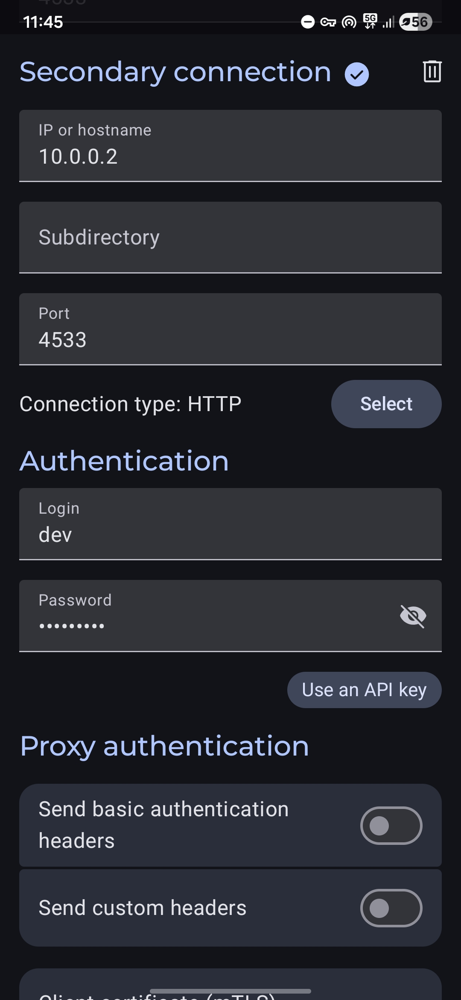
</p>

---

This keeps the service fully private while still allowing remote streaming from anywhere.


### Playlist Import Script

My music library is organized in folders, where each folder represents a playlist.

Navidrome recognizes standard playlist files such as `.m3u`, so I created a small script to automatically generate playlist files from those folders.

Create:

```bash
nano importInNavidrome.sh
```

Add:

```bash
#!/bin/bash
cd /data/shares/media/music/ || exit 1

for dir in */; do
    find "$dir" -type f -name "*.flac" | sort > "${dir%/}.m3u"
done
```

Make executable:

```bash
chmod +x importInNavidrome.sh
```

Run:

```bash
./importInNavidrome.sh
```

---

### How It Works

Example structure before running:

```text
/music/playlists/
├── Good Shit!/
├── Pop/
└── Killing the Classics/
```

After running the script:

```text
/music/playlists/
├── Good Shit!/
├── Good Shit!.m3u
├── Pop/
├── Pop.m3u
├── Killing the Classics/
└── Killing the Classics.m3u
```

Each generated `.m3u` file contains the `.flac` tracks found inside the matching folder.

This allows Navidrome to import folder-based playlists automatically.

---


## Obsidian + Syncthing - Notes & Synchronization

For note-taking and knowledge management, I use **Obsidian** together with **Syncthing**.

Obsidian is essentially my self-hosted equivalent of Notion, but focused on local Markdown files and vaults.

Syncthing handles synchronization across all devices.

This setup gives me two possible workflows:

- **Server-hosted only** → run Obsidian in Docker and access it through the browser
- **Fully synchronized setup** → use Syncthing so every device can use the native Obsidian app while keeping everything synced

The second option is what I mainly use.

---

### Obsidian - Browser Hosted Instance

Official documentation:

https://docs.linuxserver.io/images/docker-obsidian/

Docker Compose path:

```text
/srv/docker/obsidian/docker-compose.yml
````

Docker Compose:

```yaml
services:
  obsidian:
    image: lscr.io/linuxserver/obsidian:latest
    container_name: obsidian
    environment:
      - PUID=1000
      - PGID=1000
      - TZ=Europe/Bucharest
    volumes:
      - /data/shares/media/notes:/config
    ports:
      - 3000:3000
      - 3001:3001
    shm_size: "1gb"
    restart: unless-stopped
```

Vault storage:

```text
/data/shares/media/notes
```

This directory stores all vaults and note data.

Start the container:

```bash
cd /srv/docker/obsidian
docker compose up -d
```

Access in browser:

```text
https://192.168.0.108:3001
```

Initial setup:

* create `vaults/`
* create first vault (`school` in my case)

Screenshot:

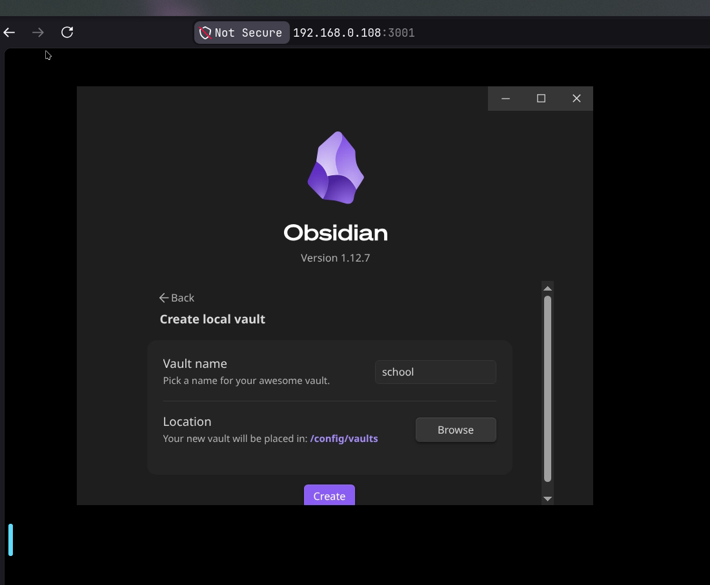

---

### Syncthing - Cross Device Sync

Official documentation:

[https://docs.linuxserver.io/images/docker-syncthing/](https://docs.linuxserver.io/images/docker-syncthing/)

Docker Compose path:

```text
/srv/docker/syncthing/docker-compose.yml
```

Docker Compose:

```yaml
services:
  syncthing:
    image: lscr.io/linuxserver/syncthing:latest
    container_name: syncthing
    hostname: syncthing-server
    environment:
      - PUID=1000
      - PGID=1000
      - TZ=Europe/Bucharest
    volumes:
      - /data/services/syncthing:/config
      - /data/shares/media/notes/vaults:/obsidian
    ports:
      - 8384:8384
      - 22000:22000/tcp
      - 22000:22000/udp
      - 21027:21027/udp
    restart: unless-stopped
```

Config storage:

```text
/data/services/syncthing
```

Shared notes directory:

```text
/data/shares/media/notes/vaults
```

Start the container:

```bash
cd /srv/docker/syncthing
docker compose up -d
```

Access dashboard:

```text
http://192.168.0.108:8384
```

Create a Syncthing user:

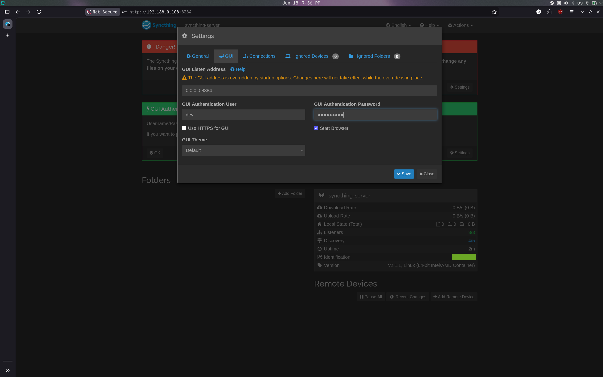

---

### Adding Devices

On PC / Phone:

Install Syncthing and open the dashboard.

Create a user on the device.

---

On the server:

Show the device ID (string or QR code).

Copy it.

Screenshot:

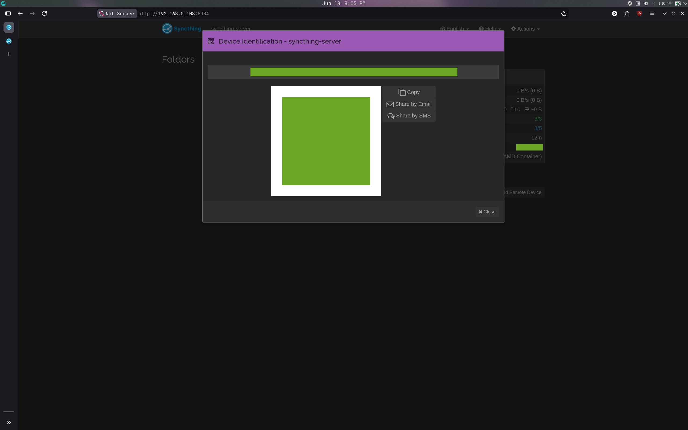

---

On the client:

Paste the server ID and add it.

Screenshot:

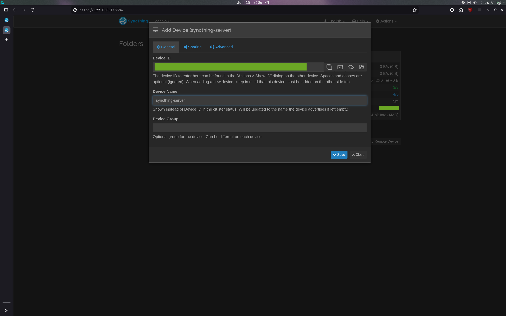

---

Back on the server:

Accept the new device connection.

Screenshot:

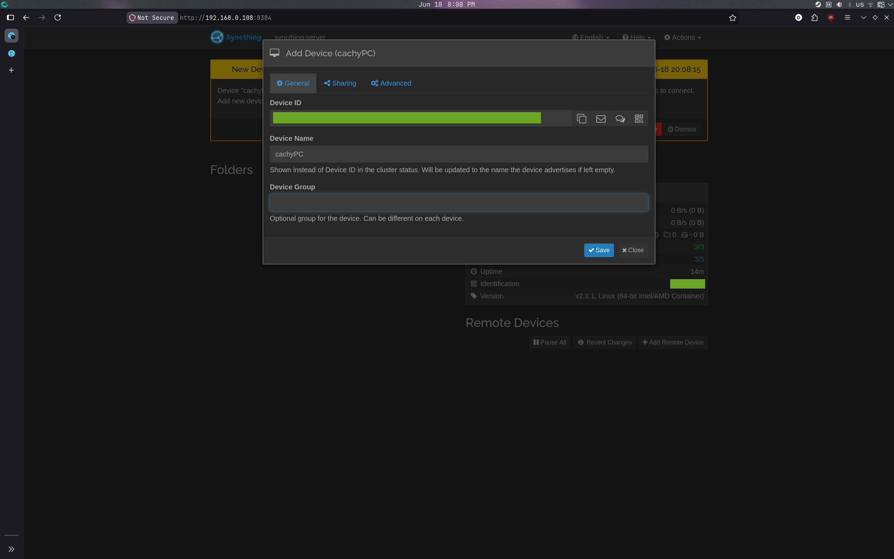

---

### Creating Shared Vault Folder

On the server, create a shared folder inside Syncthing.

Folder path:

```text
/obsidian
```

This corresponds to:

```text
/data/shares/media/notes/vaults
```

because of the Docker volume mapping.

Screenshot:

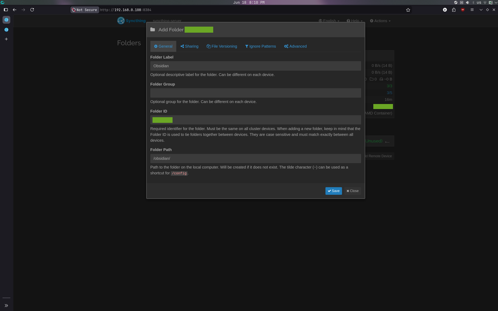

---

Share it with the client:

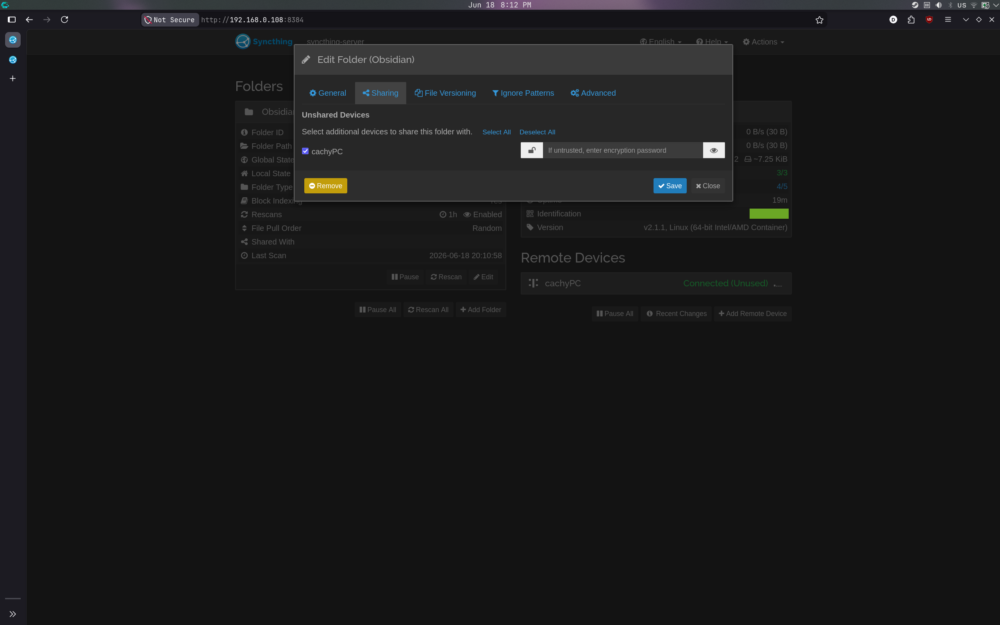

---

On the client:

Accept the sync request.

Select where the vault should be stored.

In my case:

```text
/home/onyo/Obsidian/
```

Screenshot:

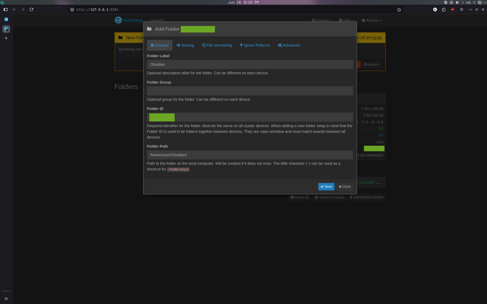

---

The same exact process applies for mobile devices.

---

### Workflow

After synchronization is complete:

* the server keeps the main vault copy
* all devices stay synchronized automatically
* devices can use the native Obsidian app
* the browser-hosted Obsidian remains available as a fallback

This makes the setup flexible and fully self-hosted.

---

### VPN Access

Both services can also be accessed remotely through the WireGuard tunnel.

Obsidian over VPN:

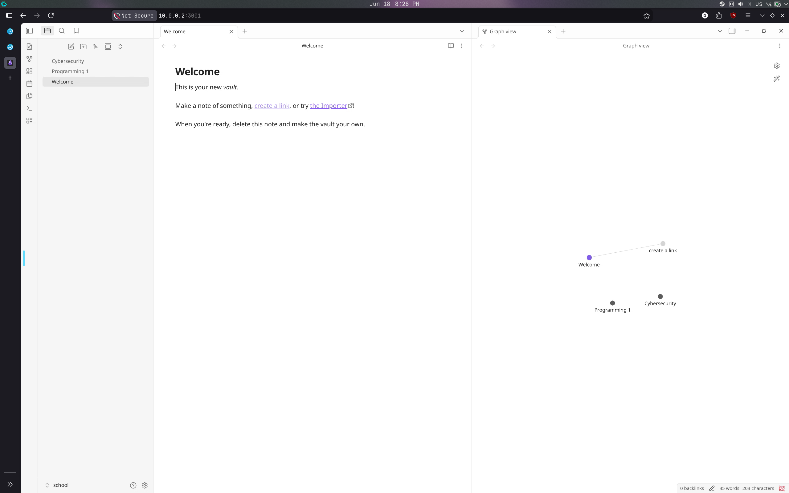

---

Syncthing GUI over VPN:

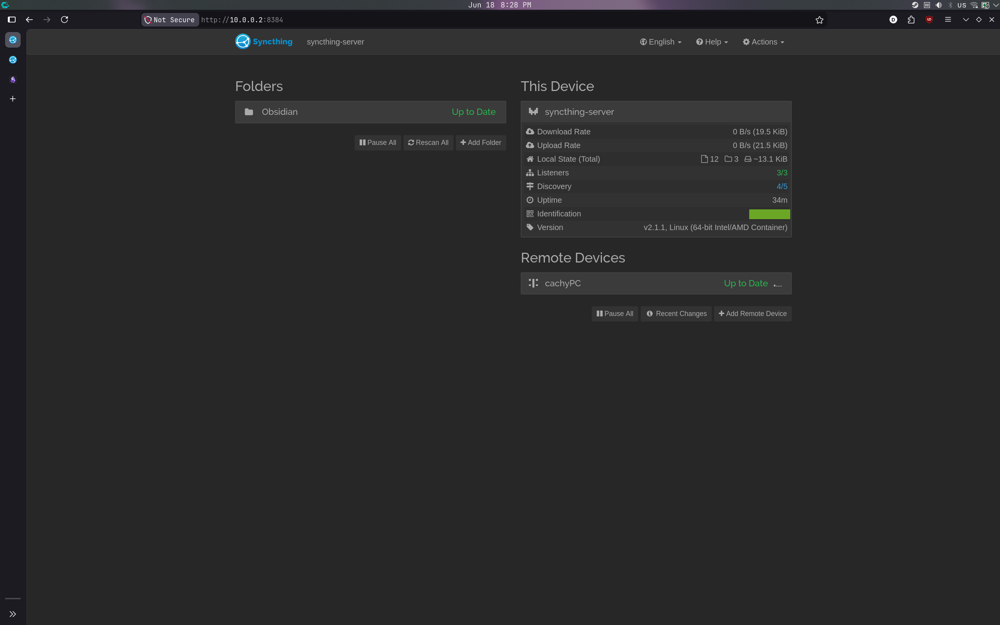

---

This allows secure remote note access without exposing anything publicly.

---

### Screenshots & Demo

Live synchronization demonstration:

<p align="center">
  <video src="https://github.com/user-attachments/assets/35001b70-7204-4123-ac98-90d060e8fddd" controls width="80%"></video>
</p>

---

Demo setup:

Left side:

* server-hosted Obsidian in browser
* server terminal monitoring file changes:

```bash
watch -n 1 -d ls -lh /data/shares/media/notes/vaults/school
```

Right side:

* client native Obsidian app
* Dolphin file manager:

```text
/home/onyo/Obsidian
```

The demo shows:

* editing on client → sync to server
* editing on server → sync to client

This verifies real-time synchronization across all devices while remaining fully self-hosted.

---


## Lancache - Local Game Download Cache

**Lancache** is a self-hosted caching solution designed to locally cache game downloads and updates.

It supports platforms such as:

- Steam
- Epic Games
- Riot Games
- Battle.net
- many others

Official website:

https://lancache.net/

---

### Why Use It

Lancache stores downloaded game files locally on the server.

Benefits:

- faster re-downloads
- reduced repeated internet bandwidth usage
- useful for multiple PCs on the same network
- ideal for LAN environments

If one machine downloads a game, the cached data can later be reused by other machines.

---

### Installation

Clone the official repository:

```bash
cd /srv/docker
git clone https://github.com/lancachenet/docker-compose lancache
cd lancache
```

Edit the environment file:

```bash
sudo nano .env
```

Configuration example:

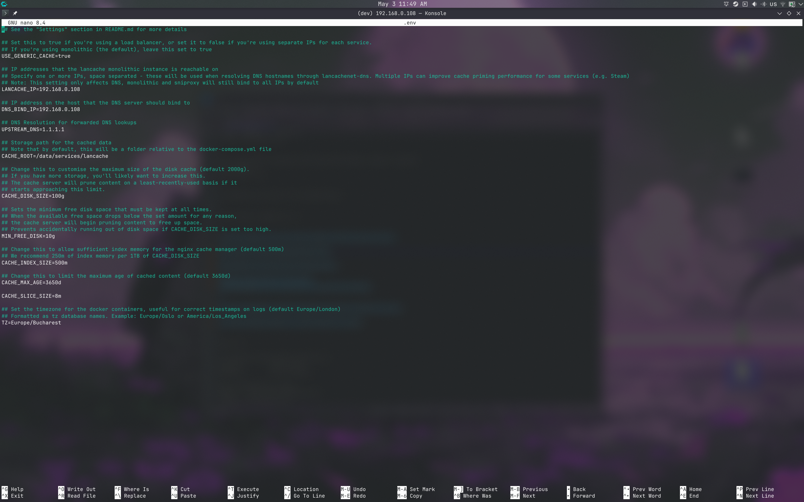

Start the service:

```bash
sudo docker compose up -d
```

---

### DNS Configuration (Linux Test Client)

I only tested Lancache on my **Linux laptop**.  
This is the method I used.

Edit the systemd-resolved configuration:

```bash
sudo nano /etc/systemd/resolved.conf
```

Example configuration:

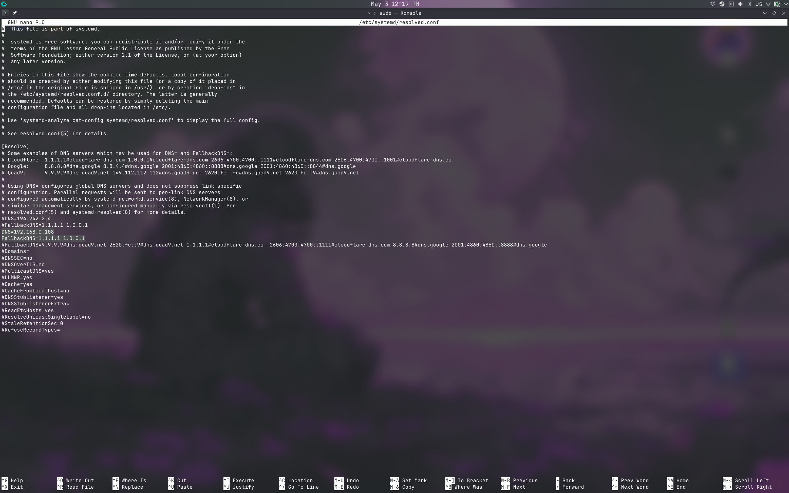

Set:

```ini
DNS=192.168.0.108
FallbackDNS=1.1.1.1 8.8.8.8
```

Where:

- `192.168.0.108` → my Lancache / home server
- `1.1.1.1` and `8.8.8.8` → backup DNS resolvers

Restart the resolver service:

```bash
sudo systemctl restart systemd-resolved
```

Flush DNS cache:

```bash
sudo systemd-resolve --flush-caches
```

This ensures new DNS requests use the updated configuration.

---

### Testing

Run:

```bash
nslookup steam.cache.lancache.net
```

Expected result:

```text
Server:         127.0.0.53
Address:        127.0.0.53#53

Non-authoritative answer:
Name:   steam.cache.lancache.net
Address: 192.168.0.108
```

Where:

- `192.168.0.108` = Lancache server IP

This confirms the domain resolves to the local cache server.

---

### Real World Testing

#### First Download (Not Cached Yet)

The game is downloaded normally from the internet while simultaneously being cached on the server.


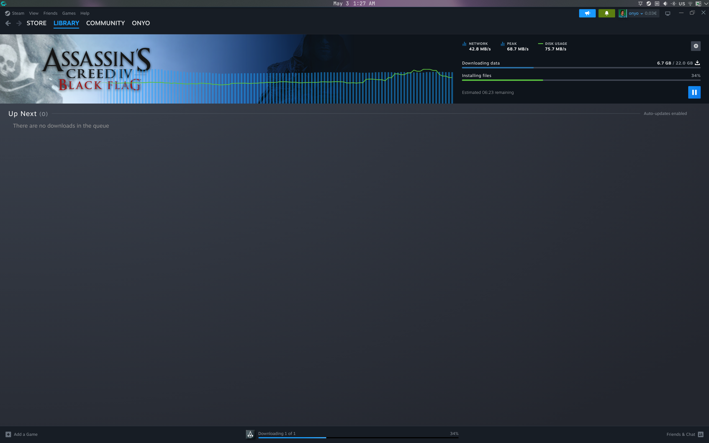

---

#### Cache Files Stored on Server

After the first run, files are stored locally on the server.


---

#### Second Download (Cached)

Re-downloading the same game pulls files directly from the local server.

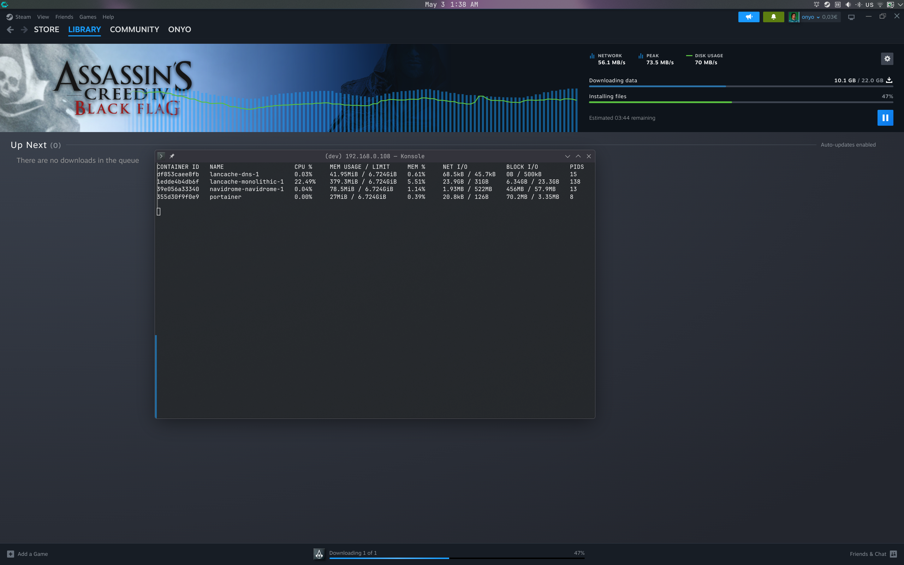

---

### Performance Notes

At my current location, the speed difference is **not dramatic** because I already have strong internet connectivity.

Current setup:

- 1 Gbit internet plan
- router Wi-Fi limited to around **500 Mbit/s**
- laptop already maxing Wi-Fi throughput

So while Lancache is still noticeable, the gain is smaller.

---

### Previous Testing in Another Location

I tested Lancache previously in another location with:

- 1 Gbit internet plan
- better router (Wi-Fi ~1 Gbit/s)
- real speeds around **800–900 Mbit/s**

In that setup, the performance difference was much more visible.

---

#### Without Cache

Peak download speed was around **48 MB/s**.

<p align="center">
  
</p>

---

#### After Cached

Once the files were cached locally, peak speed increased to around **74 MB/s**.

<p align="center">
  
</p>

---

> **Note:** 
> This service will likely not remain permanently on my server.  
>
> My current biggest bottleneck is **storage capacity**, and Lancache can consume a large amount of disk space over time.
>
> I mainly deployed it as an experiment to test how it works.

---

## Minecraft - LAN Server

I also host a **Minecraft server** on the home server.

It can be accessed both:

- through the **local network (LAN)**
- through the **WireGuard VPN tunnel**

However, in my current setup the VPN traffic is routed through a **VPS relay**, which adds extra latency.

Because Minecraft is sensitive to ping and responsiveness, the experience is noticeably better on the local network.

For that reason, I mainly use it as a **LAN server**, while VPN access remains useful for administration or occasional remote play.

---

### Why I Chose LinuxGSM

For managing the server, I chose **LinuxGSM**.

Official documentation:

https://docs.linuxgsm.com/

LinuxGSM is an excellent game server manager because it supports many games and automates tasks such as:

- downloading server files
- installing dependencies
- starting / stopping servers
- monitoring
- backups
- updates

It works largely out of the box without manually installing game server files and dependencies.

I chose it because I already used it successfully in the past on a VPS for a public Minecraft server.

---

### Why Not Docker

I did **not** use the Docker version of LinuxGSM because:

- it is marked as experimental
- receives fewer updates
- native installation is simpler and more mature

---

### Other Popular Panels / Managers

There are several other great solutions:

- **Pterodactyl Panel**
- **AMP** *(paid)*
- **Crafty Controller** *(Minecraft-focused)*

More options:

https://www.ghostcap.com/game-server-control-panels

For my needs, LinuxGSM was the best fit.

---

### Installation

Create a dedicated user:

```bash
sudo adduser mcserver
````

Optional:

```bash
sudo usermod -aG sudo mcserver
```

> If the user has sudo privileges, LinuxGSM can automatically install missing dependencies.

Switch user:

```bash
su - mcserver
```

Install LinuxGSM:

```bash
curl -Lo linuxgsm.sh https://linuxgsm.sh && chmod +x linuxgsm.sh && bash linuxgsm.sh mcserver
```

Install the Minecraft server:

```bash
./mcserver install
```


### Common LinuxGSM Commands

Run these commands as the `mcserver` user:

```bash
./mcserver start
./mcserver stop
./mcserver restart
./mcserver details
./mcserver monitor
./mcserver update
./mcserver backup
./mcserver console
````

Explanation:

* `start` → starts the Minecraft server
* `stop` → safely stops the server
* `restart` → restarts the server
* `details` → shows server information (IP, ports, status, etc.)
* `monitor` → checks if the server is running and can restart it if needed
* `update` → updates server files
* `backup` → creates a backup
* `console` → opens the live server console

---

Example usage:

```bash
su - mcserver
./mcserver details
```


---

### Server Backups

Initially, I considered using symbolic links so the live server files would exist in:

```text
/data/shares/minecraft
```

with symlinks inside:

```text
/home/mcserver/
```

But using the built-in LinuxGSM backup system is much cleaner.

LinuxGSM backup command:

```bash
./mcserver backup
```

Backup destination:

```text
/data/shares/minecraft
```

Set permissions:

```bash
sudo chown -R mcserver:mcserver /data/shares/minecraft
sudo chmod -R 755 /data/shares/minecraft
```

Edit config:

```bash
nano /home/mcserver/lgsm/config-lgsm/mcserver/mcserver.cfg
```

Set:

```bash
backupdir="/data/shares/minecraft"
maxbackups="3"
```

---

### Automated Daily Backup

As user `mcserver`:

```bash
crontab -e
```

Add:

```cron
0 2 * * * /home/mcserver/mcserver backup > /dev/null 2>&1
```

Meaning:

* Minute `0`
* Hour `2`
* Every day

So a backup runs daily at **02:00 AM**.

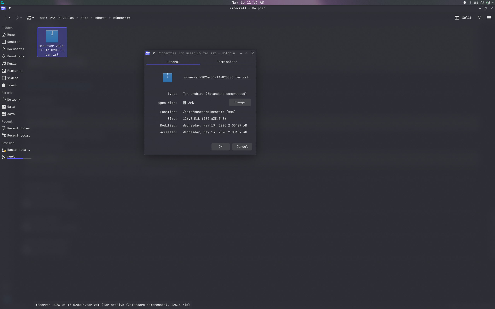

---

### Common `server.properties` Changes

Typical settings I modify:

```properties
difficulty=easy (Values: peaceful, easy, normal, hard)
pvp=true (Values: true, false)
gamemode=survival (Values: survival, creative, adventure, spectator)
force-gamemode=false (Values: true, false)
max-players=20 (Values: Any number)
online-mode=true (Values: true, false)
view-distance=10 (Values: Usually 5 to 32)
simulation-distance=10 (Values: Usually 5 to 32)
```

Reference:

[https://minecraft.wiki/w/Server.properties](https://minecraft.wiki/w/Server.properties)

---

### Common Console Commands

Usable in-game (if operator) or from server console:

```text
op PlayerName
deop PlayerName

tp Player1 Player2
tp X Y Z

kick PlayerName Reason

gamemode survival PlayerName
gamemode creative PlayerName
```

Reference:

[https://minecraft.wiki/w/Commands](https://minecraft.wiki/w/Commands)

---

### Access Methods

#### Local Network (Recommended)

```text
192.168.0.108:25565
```

Best experience with the lowest latency.

#### Through WireGuard VPN

```text
10.0.0.2:25565
```

Works correctly, but due to the VPS relay tunnel latency is higher than LAN.

---

### Screenshots & Demo

#### LinuxGSM Server Details

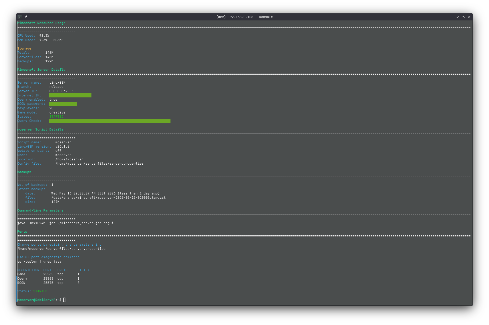

---

#### Live Server Console

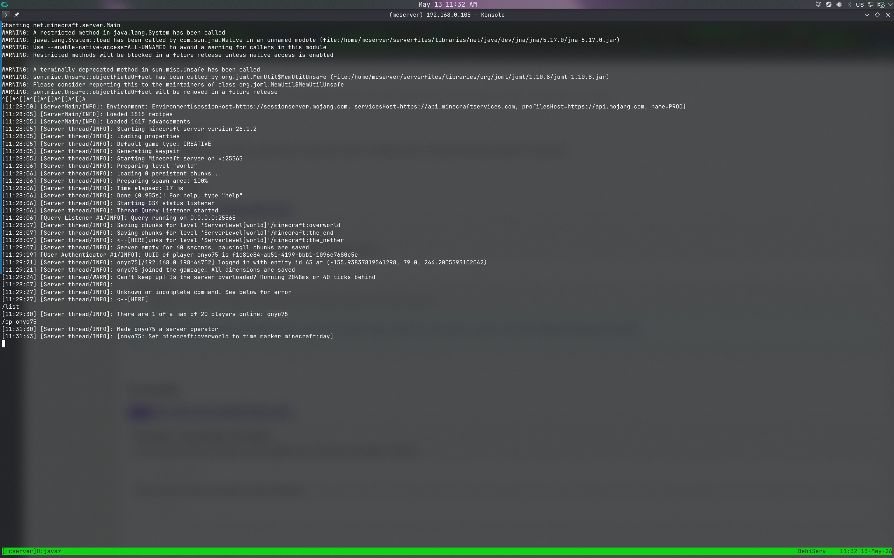

---

#### Client Demo

<p align="center">
  <video src="https://github.com/user-attachments/assets/458992b5-eab8-414e-9c02-8c0084472fe4" controls width="80%"></video>
</p>


---

# Remote Access - Wireguard VPN

Since my home server is located on a residential connection, direct remote access doesn't work. 

To solve this, I built a **private WireGuard relay setup** using a VPS with a public IPv4 address.

This creates a secure path to access my home server from anywhere without exposing services directly to the public internet.

---

## Why I Chose This Option

This solution fit my requirements best for several reasons:

- my home network is behind **CGNAT**, so I do not have a true public IPv4 address
- my ISP does **not provide IPv6**
- I did not want to rely on commercial tunneling solutions such as **Cloudflare Tunnel** or **Tailscale**
- I did not want to expose ports/services directly to the internet
- I wanted a **private, self-managed, secure** solution

---

## Network Flow

```text
Laptop / Phone
      │
 WireGuard Tunnel
      │
 Public VPS Relay
      │
 WireGuard Tunnel
      │
 ThinkPad Home Server
````

All traffic between devices is encrypted.

Only authorized peers with valid keys can connect.

---

## Key Generation

I generated all WireGuard keypairs on one trusted device, then securely copied each key to its destination device.


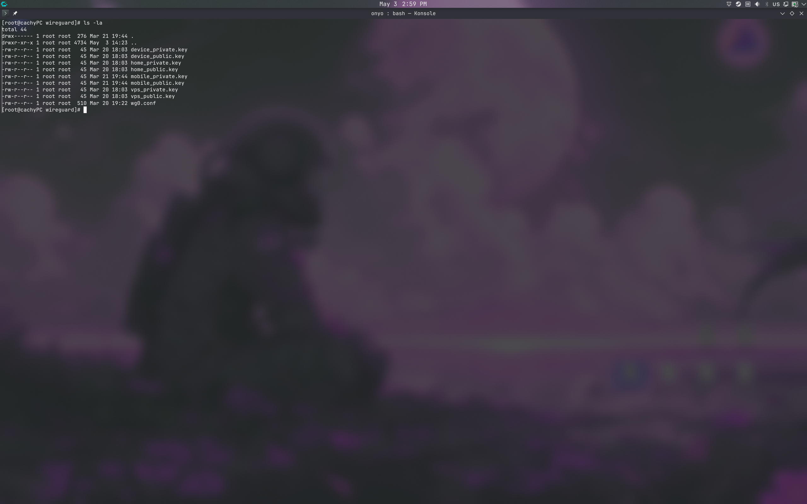

Generate keys:

```bash
# Generate VPS keys
wg genkey | tee vps_private.key | wg pubkey > vps_public.key

# Generate Home Server keys
wg genkey | tee home_private.key | wg pubkey > home_public.key

# Generate Remote Device 1 keys
wg genkey | tee device_private.key | wg pubkey > device_public.key

# Generate Remote Device 2 keys
wg genkey | tee mobile_private.key | wg pubkey > mobile_public.key
```

---

## VPS Relay Server

For this setup I used a **Hetzner VPS** because it offers excellent price/performance.

> Note: #NotAnAdd

Specs:

* 2 vCPU
* 4 GB RAM
* 40 GB SSD
* 1 Public IPv4
* ~5 EUR/month

I selected the location closest to me for lower latency.

Operating system:

* Debian


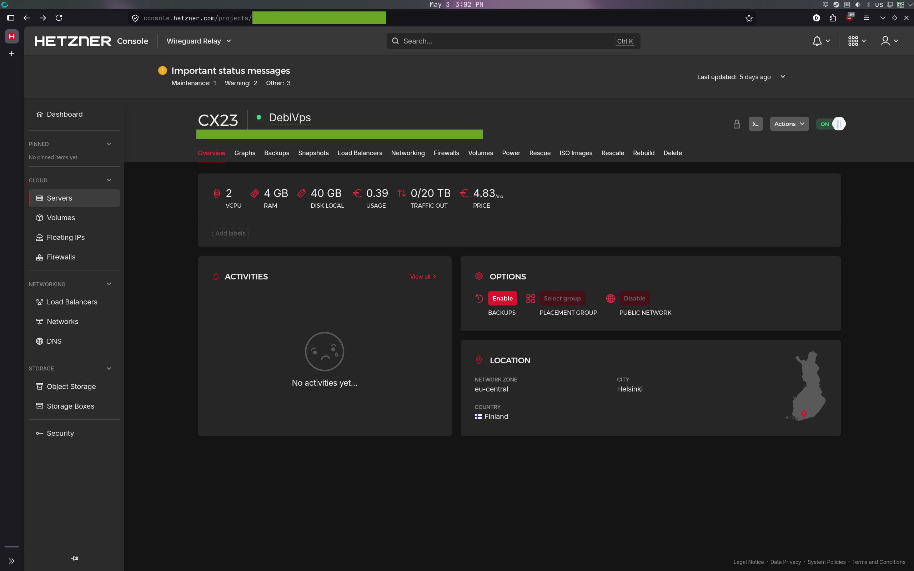

---

## Secure SSH Access to VPS

Generate SSH key from your device:

```bash
ssh-keygen -t ed25519 -C "email@something.com"
```

Upload the public key during VPS deployment.

Then harden SSH:

```bash
sudo nano /etc/ssh/sshd_config
```

Set:

```text
PasswordAuthentication no
PubkeyAuthentication yes
PermitEmptyPasswords no
```

Restart SSH:

```bash
sudo systemctl restart ssh
```

This allows login only with a valid SSH key, which is significantly safer than password authentication.

---

## Enable IP Forwarding (VPS)

```bash
echo "net.ipv4.ip_forward=1" | sudo tee -a /etc/sysctl.conf
sudo sysctl -p
```

---

## Firewall Setup (UFW)

```bash
sudo ufw default deny incoming
sudo ufw default allow outgoing

sudo ufw allow OpenSSH
sudo ufw allow 51820/udp

sudo ufw enable
```

---

## VPS WireGuard Configuration

File:

```bash
/etc/wireguard/wg0.conf
```

```ini
[Interface]
Address = 10.0.0.1/24
ListenPort = 51820
PrivateKey = <INSERT_VPS_PRIVATE_KEY>

# Peer: Home Server
[Peer]
PublicKey = <INSERT_HOME_SERVER_PUBLIC_KEY>
AllowedIPs = 10.0.0.2/32

# Peer: Remote Device1
[Peer]
PublicKey = <INSERT_REMOTE_DEVICE_PUBLIC_KEY>
AllowedIPs = 10.0.0.3/32

# Peer: Remote Device2
[Peer]
PublicKey = <INSERT_REMOTE_DEVICE_PUBLIC_KEY>
AllowedIPs = 10.0.0.4/32
```

Start:

```bash
sudo wg-quick up wg0
sudo systemctl enable wg-quick@wg0
```

---

## Home Server Peer Configuration

File:

```bash
/etc/wireguard/wg0.conf
```

```ini
[Interface]
Address = 10.0.0.2/24
PrivateKey = <INSERT_HOME_SERVER_PRIVATE_KEY>

[Peer]
PublicKey = <INSERT_VPS_PUBLIC_KEY>
Endpoint = <VPS_PUBLIC_IP>:51820
AllowedIPs = 10.0.0.0/24
PersistentKeepalive = 25
```

Why `PersistentKeepalive = 25` matters:

Because the server is behind CGNAT, it must maintain an outbound tunnel so the VPS can always reach it.

Start:

```bash
sudo wg-quick up wg0
sudo systemctl enable wg-quick@wg0
```

---

## Client Configuration (Laptop / Phone)

File:

```bash
/etc/wireguard/wg0.conf
```

```ini
[Interface]
Address = 10.0.0.3/24
PrivateKey = <INSERT_REMOTE_DEVICE_PRIVATE_KEY>
DNS = 1.1.1.1

[Peer]
PublicKey = <INSERT_VPS_PUBLIC_KEY>
Endpoint = <VPS_PUBLIC_IP>:51820
AllowedIPs = 10.0.0.0/24
PersistentKeepalive = 25
```

---

## Split Tunnel Behavior

This configuration uses **split tunneling**.

Only traffic destined for:

```text
10.0.0.0/24
```

goes through WireGuard.

Everything else uses the normal internet connection.

That means:

* access home services privately through VPN
* normal browsing still uses local internet

---

## Client Usage

### Linux Laptop

Turn VPN on:

```bash
sudo wg-quick up wg0
```

Turn VPN off:

```bash
sudo wg-quick down wg0
```

### Android

Use the official WireGuard app and toggle the tunnel on/off.

<p align="center">
  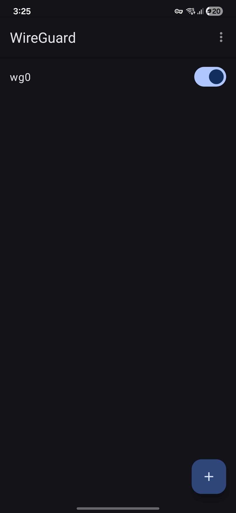
</p>

---

## Testing Connectivity

### On VPS

```bash
sudo wg show
```

Shows peers, handshakes, transfer stats.

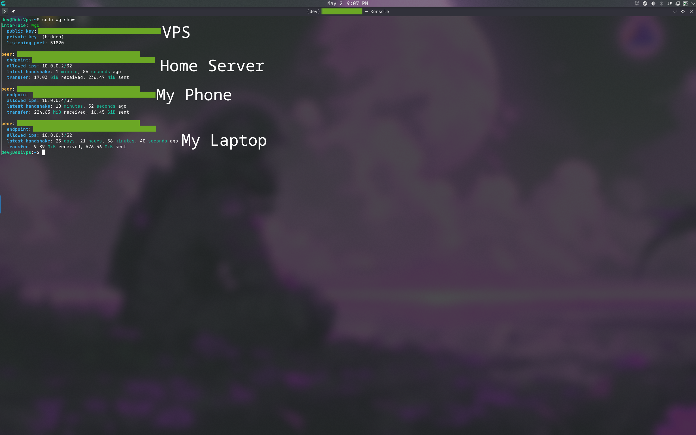

---

### From Laptop

Ping VPS:

```bash
ping 10.0.0.1
```

Ping Home Server:

```bash
ping 10.0.0.2
```


---

### From Home Server


Ping VPS:

```bash
ping 10.0.0.1
```

Ping Laptop:

```bash
ping 10.0.0.3
```

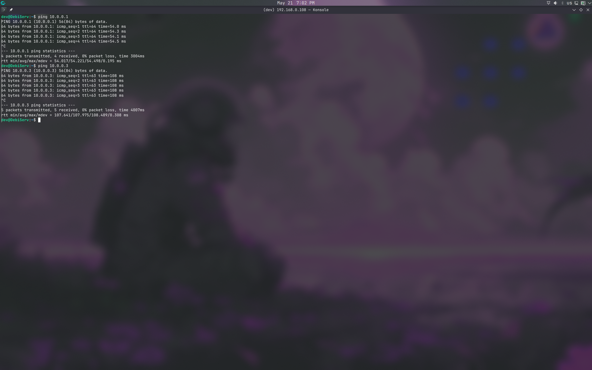

---

## Result

This gives me secure remote access to:

* SSH
* Samba
* Navidrome
* any LAN-only service

without exposing anything publicly.


---


# Backup

This section covers the backup setup used in the homelab environment.

The goal is to maintain a secondary copy of important data from the main server on a separate machine inside the network.

The **HP** acts as the dedicated backup server, while the **ThinkPad** sends encrypted backups using BorgBackup.

---

## BorgBackup

Official website:

https://www.borgbackup.org/

BorgBackup is a powerful backup solution featuring:

- deduplication
- compression
- encryption
- incremental backups

---

## Install BorgBackup

Install on both servers:

```bash
sudo apt install borgbackup
````

---

## Backup Server Configuration

Create a dedicated backup user:

```bash
sudo useradd --system --create-home --shell /bin/bash borguser
sudo passwd borguser
```

Switch user:

```bash
sudo su - borguser
```

Create backup directory:

```bash
mkdir -p ~/backups/MainServer
```

After setup is complete, lock password authentication:

```bash
sudo passwd -l borguser
```

This disables password login while still allowing SSH key authentication from the main server.

---

## Main Server Configuration

All commands below are executed as root.

Switch to root:

```bash
sudo su -
```

> Some directories require root permissions for proper backup access.

---

### Generate SSH Key

```bash
ssh-keygen -t ed25519
```

Copy the public key to the backup server:

```bash
ssh-copy-id -i ~/.ssh/id_ed25519.pub borguser@192.168.0.109
```

Test connection:

```bash
ssh borguser@192.168.0.109
```

---

## Initialize Borg Repository

```bash
borg init --encryption=repokey borguser@192.168.0.109:~/backups/MainServer
```

This creates an encrypted Borg repository on the backup server.

---

## Automated Backup Script

Create backup script:

```bash
sudo nano /usr/local/bin/borg-backup.sh
```

Content:

```bash
#!/bin/bash

export BORG_REPO="borguser@192.168.0.109:~/backups/MainServer"
export BORG_PASSPHRASE="<YOUR KEY>"

borg create --verbose --stats \
    ::'{hostname}-{now:%Y-%m-%d_%H:%M}' \
    /data

borg prune --verbose --list \
    --keep-daily=7 \
    --keep-weekly=4 \
    --keep-monthly=6

borg compact
```

Make executable:

```bash
sudo chmod 700 /usr/local/bin/borg-backup.sh
```

---

## Running the Backup

Manual run:

```bash
sudo /usr/local/bin/borg-backup.sh
```

---

## Automated Backups with Cron

Edit root cron jobs:

```bash
sudo crontab -e
```

Example daily backup at 03:00 AM:

```cron
0 3 * * * /usr/local/bin/borg-backup.sh > /dev/null 2>&1
```

---

## Backup Strategy

Current backup target:

```text
/data
```

This includes:

* shared files
* media
* service data
* Docker persistent volumes

The backup server acts as a secondary storage location inside the home network.

---

## Security Notes

* backups are encrypted using Borg's `repokey` encryption
* SSH password login is disabled for the backup user


---

## Screenshots

### Borg Repository

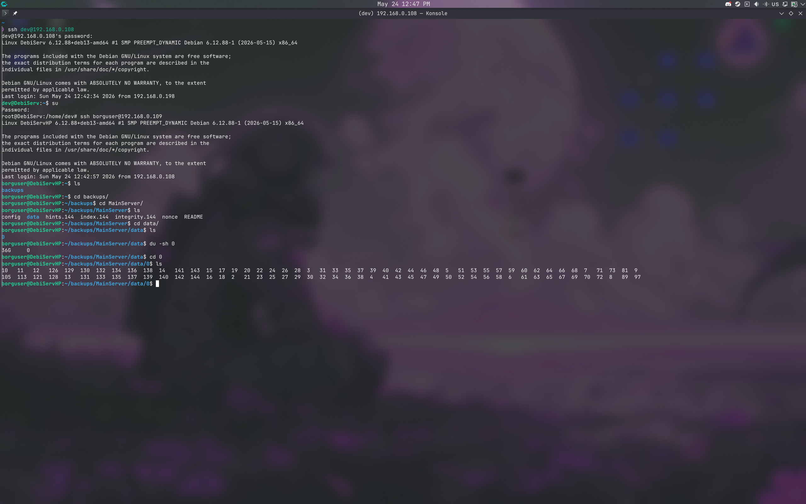

---

### List Backups

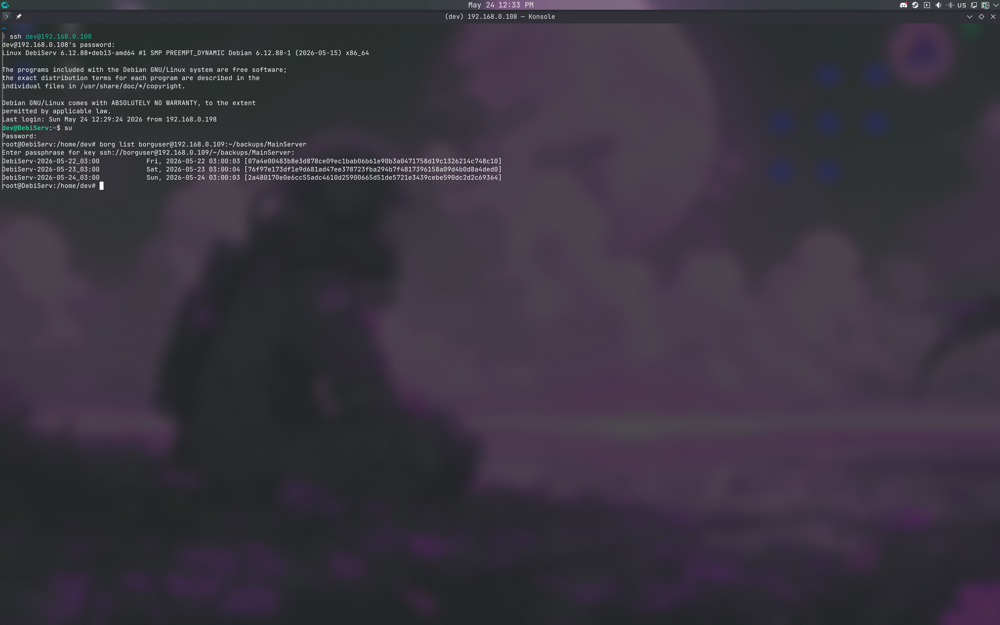

---

### Backup Log File

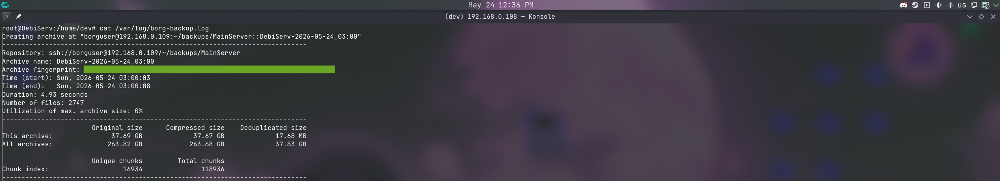

---


